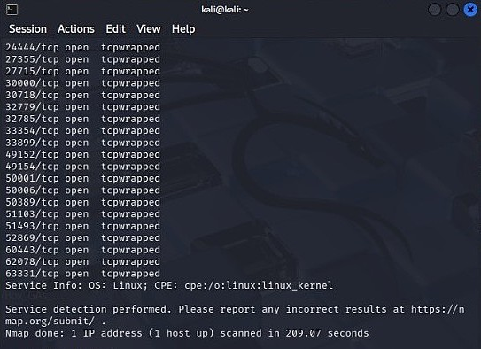

# Reconnaissance Findings

## Summary
A controlled reconnaissance scan was conducted against a publicly permitted target to observe how automated systems respond to non-human probing activity.

## Observations
- Numerous high-numbered TCP ports were identified as open.
- All exposed ports were labeled as `tcpwrapped`, indicating active filtering or connection management.
- No standard application services (e.g., HTTP, SSH) were exposed.
- OS fingerprinting was limited to a generic Linux kernel identification.

## Behavioral Indicators
The presence of `tcpwrapped` across multiple ports suggests defensive mechanisms designed to acknowledge connection attempts while restricting service interaction. This behavior is consistent with firewall rules, intrusion detection systems, or connection wrapper technologies.

The extended scan duration further indicates throttling or scan-evasion techniques intended to impede automated reconnaissance tools.

## Defensive Interpretation
From a defensive perspective, the system appears hardened against reconnaissance and intentionally minimizes fingerprintable information. The behavior observed aligns with machine-aware security controls rather than misconfiguration.

## Relevance to Behavioral Authentication
Rather than relying on credential-based authentication, the target system demonstrates contextual trust evaluation—responding differently to automated probes than it would to legitimate, human-driven interaction.

## Evidence

## Analyst Conclusion

The observed network behavior suggests that the target system is not solely relying on traditional service exposure for interaction, but instead applying behavioral or contextual filtering mechanisms.

Rather than responding equally to all connection attempts, the system differentiates between automated reconnaissance activity and legitimate user-driven interaction.

This aligns with modern defensive strategies that prioritize behavioral analysis over static trust models, reinforcing the concept that identity alone is not sufficient—behavior must also be validated.
